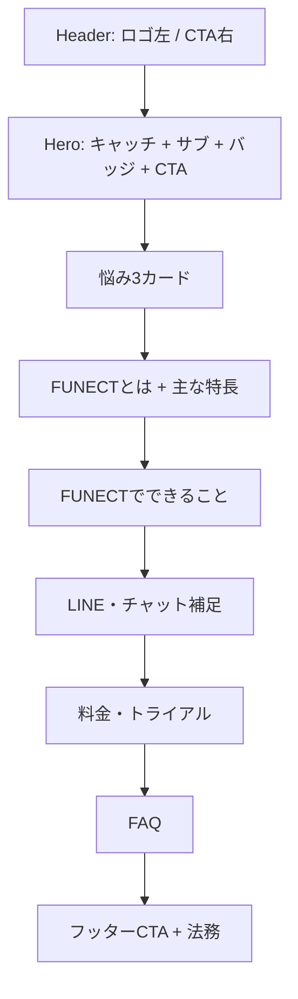

# FUNECT LP ワイヤーフレーム（KaruteKun 参考レイアウト）

**製品名**: AIコンシェルジュ **FUNECT**  
**目的**: 広告・資料導線用の縦長1カラムLP。参考として [KaruteKun lp_102](https://karutekun.com/lp_102) 系（サロン向けBtoBで一般的な **FV → 悩み → 概要 → 機能 → 料金 → FAQ → クロージング**）のブロック順を採用。  
**サービス情報の一次ソース**: [FUNECT | 株式会社TECH Plus](https://techplus-company.com/funect/)  
**詳細コピー・比較表・競合3層**: [FUNECT_LP_copy_wireframe.md](FUNECT_LP_copy_wireframe.md) に委ねる（本書はレイアウトと KaruteKun 型の流れに特化）。

**ロゴアセット（実装時）**:  
`assets/c__Users_sota0_AppData_Roaming_Cursor_User_workspaceStorage_5f9ac59c42ef1141ea6a9ed9d05f4dfc_images_logo-cb3819d7-ef30-436b-bd63-9c2fcc4ae1be.png`

---

## ビジュアル・ブランド指示（ヘッダ・トーン）

| 項目 | 指示 |
|------|------|
| ロゴ配置 | **ヘッダ左上**。ロゴ＋必要なら「AI Concierge」サブテキストをロゴ画像に含む前提。右側に Primary CTA（トライアル）。 |
| カラートーン | **ローズゴールド／シャンパンゴールド**をアクセント（アイコン・線・CTAホバー等）。本文・見出しは **ダークトープ〜チャコール** で可読性優先。背景は **白〜極薄クリーム**。 |
| コントラスト | 本文と背景は WCAG AA を目安。金属調グラデは装飾に留め、本文は単色推奨。 |
| 写真 | サロン内装 or スマホでチャットUIを見るシーンのいずれかをヒーロー右カラム or ヒーロー下に配置可能（ワイヤーでは `[ビジュアル]` プレースホルダ）。 |

---

## 表現メモ（「来店拒否」と公式コピーの対応）

LPの**悩み見出し**として「来店拒否機能が欲しい…」を使う場合、**解決策の説明文**は [公式FUNECT](https://techplus-company.com/funect/) に沿った言い換えにする。

- 公式に近い記述例: 予約管理において **スタッフごとに時間単位で予約受付不可** の設定、営業時間・枠・スタッフ条件に基づく予約コントロール等。
- **「来店拒否」という製品機能名が公式にあるわけではない**ため、確定コピーはプロダクト・法務と整合させること。

---

## ページ全体：スクロール順（ASCII）

```
┌─────────────────────────────────────────────────────────────────┐
│ [LOGO]                    [2週間トライアルを申し込む] [お問い合わせ] │  ← sticky 可
├─────────────────────────────────────────────────────────────────┤
│ ░ 1. HERO ░                                                      │
│   [バッジ: 2週間トライアル / 月額9,800円(税抜)・初期費用なし]     │
│   H1 キャッチ │ サブ2〜3行 │ 補足1行（人的引き継ぎ）               │
│   [Primary CTA] [Secondary]     │  [ビジュアル: チャット/サロン]   │
├─────────────────────────────────────────────────────────────────┤
│ ░ 2. よくある悩み（3カード）░  ← 本LPの主役（指定3点）             │
│   H2「こんなお悩みに」短いリード1行                                │
│   ┌──────────┐ ┌──────────┐ ┌──────────┐                        │
│   │ カード1   │ │ カード2   │ │ カード3   │  → 375pxは縦積み      │
│   └──────────┘ └──────────┘ └──────────┘                        │
│   [ CTA 繰り返し ]                                               │
├─────────────────────────────────────────────────────────────────┤
│ ░ 3. FUNECTとは + 主な特長 ░                                     │
│   H2 / リード / 特長3〜4（公式の「主な特長」要約）                 │
├─────────────────────────────────────────────────────────────────┤
│ ░ 4. FUNECTでできること ░                                        │
│   グリッド or アコーディオン（アイコン＋短文化）                   │
│   公式の見出し順に沿って列挙（下表参照）                         │
├─────────────────────────────────────────────────────────────────┤
│ ░ 5. LINE・チャット補足 ░                                        │
│   短い1セクション（LINE連携・AI ON/OFF・人への引き継ぎ）          │
├─────────────────────────────────────────────────────────────────┤
│ ░ 6. 料金・トライアル ░                                          │
│   料金カード / 支払い方法 / [ CTA ]                               │
├─────────────────────────────────────────────────────────────────┤
│ ░ 7. FAQ ░                                                       │
│   アコーディオン（タップ領域 44px 目安）                          │
├─────────────────────────────────────────────────────────────────┤
│ ░ 8. フッターCTA + 法務 ░                                        │
│   H2短め / CTA / 運営会社・プライバシー等                         │
└─────────────────────────────────────────────────────────────────┘
```

**CTA 出現箇所（最低）**: ヘッダ（任意）・ヒーロー・悩みブロック直後・料金ブロック下・フッター前（計4箇所目安）。

---

## フロー図（セクション依存）



---

## セクション別ワイヤー

### 1. ヘッダ

| 要素 | デスクトップ | モバイル（375px） |
|------|--------------|-------------------|
| ロゴ | 左寄せ、高さ 32〜40px 目安 | 同左、タップでトップへ |
| ナビ | 省略可（LP単体ならCTAのみでも可） | ハンバーガー or CTAのみ |
| Primary | 「2週間トライアルを申し込む」 | 右 or 下部固定バーに省略版 |
| Secondary | 「お問い合わせ」 | テキストリンク可 |

---

### 2. ヒーロー

| 要素 | 指示 |
|------|------|
| H1 | [FUNECT_LP_copy_wireframe.md](FUNECT_LP_copy_wireframe.md) の案A or B から1つ。例: 「施術中も、休みの日も。取りこぼしている「受付」を、AIコンシェルジュがつなぐ。」 |
| サブ | 予約の受付・変更・キャンセル、FAQ、LINE/チャットまで、等（ブリーフどおり2〜3行）。 |
| 補足 | 想定外・クレームは AI が勝手に答えずスタッフへ引き継ぎ（1行・小さめ）。 |
| バッジ | 2週間トライアル付き ／ 月額9,800円（税抜）・初期費用なし |
| CTA | Primary「2週間トライアルを申し込む」／ Secondary「資料請求・お問い合わせ」 |
| レイアウト | 1200px 幅: 左テキスト + 右ビジュアル。375px: 縦積み、Primary を上。 |

---

### 3. よくある悩み（指定3点・カード型）

**H2**: `こんなお悩みに` または `こんなこと、現場でありませんか`  
**リード**: 1行で「予約や運用の前後で積み上がる負担」を橋渡し（任意）。

各カード構成: **見出し（ユーザー指定文言）** ＋ **補足1〜2行** ＋ **解決のヒント（FUNECTの公式領域に紐づける）**。

| # | 悩み（表記どおり） | アンカーID（実装時） | 解決側の接続（公式ベース） |
|---|-------------------|----------------------|----------------------------|
| 1 | シフト管理がめんどくさい... | `#pain-shift` | **予約管理**: 予約可能スタッフ、勤務時間、施術可能メニュー、在籍設定。カレンダーで枠・担当を把握。 |
| 2 | 来店拒否機能が欲しい... | `#pain-refusal` | **予約の受付コントロール**: スタッフごとに時間単位で**予約受付不可**の設定（公式記載）。※悩み文言と製品名の最終整合は要確認（上記「表現メモ」参照）。 |
| 3 | カテゴリや詳細メニューごとに、施術時間と金額を登録したい... | `#pain-menu` | **メニュー表登録**: カテゴリ・詳細メニューごとに施術時間と金額を登録。 |

**本ブロック直後**: Primary CTA を再掲。

---

### 4. FUNECTとは + 主な特長

[公式](https://techplus-company.com/funect/) の構成に合わせる。

- **FUNECTとは**: 問い合わせ対応や予約受付の流れを整え、事業者と利用者の双方にとって使いやすい体験を目指す、等の要約2〜4文。
- **主な特長**（見出しレベルで4点をカード or 2×2グリッド）:
  - 分かりやすい導線設計  
  - 運用しやすい仕組み  
  - 顧客対応の最適化支援  
  - 継続的な価値提供  

---

### 5. FUNECTでできること（機能一覧の並び）

公式ページの見出し順をワイヤー上も踏襲し、**アイコン＋タイトル＋1行説明**で畳む（長文は「詳しくはコーポレートへ」リンク可）。

1. 複数店舗の登録  
2. 利用ユーザー管理  
3. 店舗情報の登録  
4. 製品情報の登録（チャットから検索・取得）  
5. 電子カルテ登録  
6. メニュー表登録  
7. チャット機能（AI回答、予約受付・変更・キャンセル、LINE連携、AI ON/OFF、人への切り替え）  
8. 予約管理（基本設定、スタッフ、カレンダー、空き枠からの操作、チャット連携 等）

---

### 6. LINE・チャット補足（短い1セクション）

| 要素 | 内容 |
|------|------|
| H2 | LINEとも連携。など（ブリーフの「LINEとの関係」を1セクションに圧縮） |
| 箇条書き | LINE からの受付、AI の ON/OFF、難しい場合は店舗対応へ、等（公式のチャット節を要約）。 |

---

### 7. 料金・トライアル

[FUNECT_LP_copy_wireframe.md](FUNECT_LP_copy_wireframe.md) と **同一前提** で記載する。

| 項目 | 内容 |
|------|------|
| 月額 | **9,800円（税抜）** |
| 初期費用 | **なし** |
| 追加費用 | **なし**（※提供範囲に応じた注釈は法務・営業と整合） |
| トライアル | **2週間** |
| お支払い | システム内・決済代行経由の **クレジットカード決済** を予定 |

**CTA**: 「2週間トライアルを申し込む」

---

### 8. FAQ

[FUNECT_LP_copy_wireframe.md](FUNECT_LP_copy_wireframe.md) の Q1〜Q6 をベースにアコーディオン化。  
質問はユーザーが知りたい順に並べ替え可（例: 予約システム併用 → AIの安全性 → 少人数運用 → チャネル → 解約 → 個人情報）。

---

### 9. フッターCTA

| 要素 | 指示 |
|------|------|
| H2 | 短いクロージング（例: まずは2週間、自店の「受付」を試す） |
| CTA | Primary + Secondary |
| フッターリンク | 運営会社（techplus-company.com 等）、プライバシーポリシー、特商法、利用規約（該当時） |

---

## レイアウト共通仕様

| 項目 | 値 |
|------|-----|
| 最大幅 | 1140〜1200px 中央寄せ |
| セクション間余白 | デスクトップ 80〜120px / モバイル 56〜80px |
| ブレークポイント | 1200px（デスクトップ）、375px（モバイル確認） |

---

## CTA 文言の統一

- **Primary**: `2週間トライアルを申し込む`  
- **Secondary**: `資料請求・お問い合わせ` または `お問い合わせ`

---

*本ドキュメントは KaruteKun 型のワイヤー指示用。コピー最終稿・A/B案・比較表は [FUNECT_LP_copy_wireframe.md](FUNECT_LP_copy_wireframe.md) を参照。*
